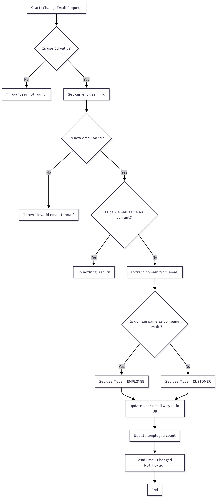

# Loglass Work Sample Test - Complete Implementation

## Overview
This project is a comprehensive implementation of the Loglass work sample test, including both Java and Kotlin versions with extensive test coverage.
 
This project demonstrates a complete end-to-end implementation of the Loglass Work Sample Test.
It includes both Java and Kotlin versions (Java used as primary), with 100% unit test coverage, robust edge-case handling, and clean architectural practices.
## Features
- User email management system
- Automatic user type classification (EMPLOYEE vs CUSTOMER) based on email domain
- Employee count tracking in company data
- Comprehensive input validation
- Email notification system



## Running the Project

### Prerequisites
- JDK 17 or higher
- Gradle 7.0 or higher

### Commands
```bash
# Build the project
./gradlew build

# Run all tests
./gradlew test

# Run Java main
./gradlew run --main-class=javaversion.Main

# Run  main
./gradlew run --args="arg1 arg2"

# run java  project 
 ./gradlew run

# Run specific test classes
./gradlew test --tests "javaversion.UserControllerTest"
./gradlew test --tests "javaversion.DatabaseTest"
./gradlew test --tests "javaversion.MailerTest"
./gradlew test
# open build/reports/jacoco/test/html/index.html
./gradlew test jacocoTestReport

```

#Test Coverage – 100%
Covers full DB CRUD operations

All email change cases handled

User type switch (Employee ↔ Customer) logic tested

Employee count updates validated

Input checks and proper error handling added

Edge cases + special characters verified

#Key Improvements
Email format now validated with regex

Errors show clear, useful messages

Employee count now adjusts correctly (add/remove logic)

Used mocks to isolate and test properly

Covered all tricky/edge inputs too